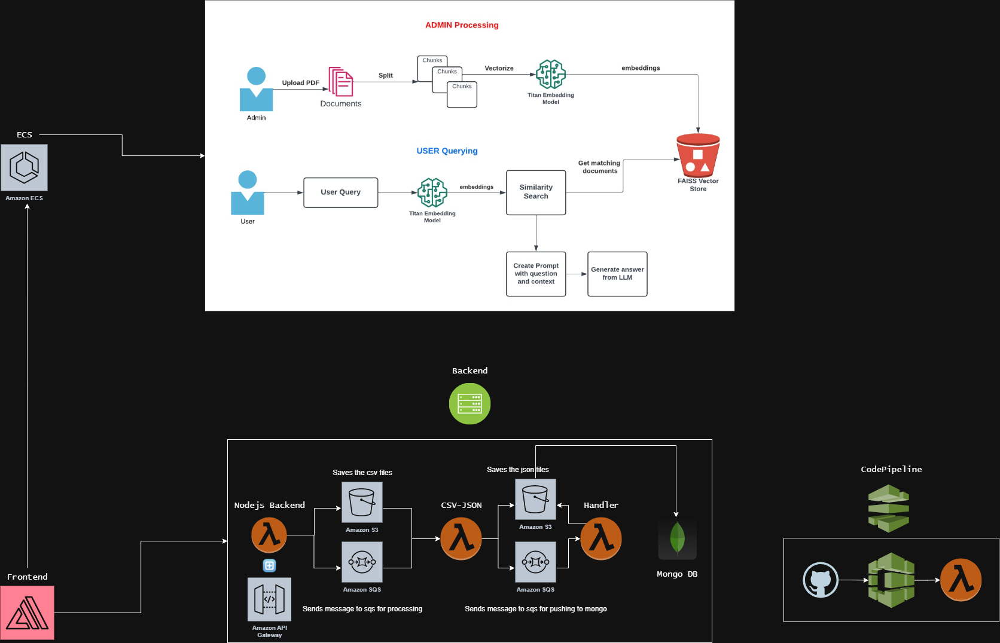
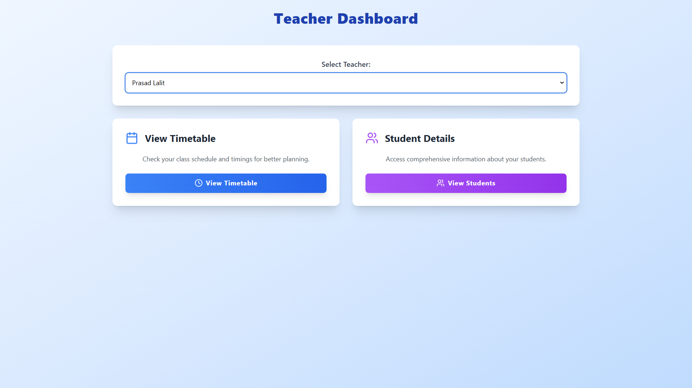
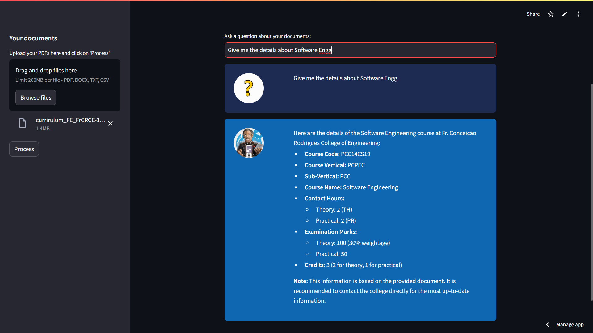

# Course Scheduling System

# Table of Contents

1. [Collaborators](#collaborators)
2. [Introduction](#introduction)
3. [Features](#features)
4. [Tech Stack](#tech-stack)
   * [Backend](#backend)
   * [Frontend](#frontend)
5. [Installation](#installation)
6. [Usage](#usage)
7. [Screenshots](#screenshots)
8. [License](#license)

## Collaborators

- [Sanyo Fonseca](https://github.com/sAnyo08)
- [Jonathan Gomes](https://github.com/JonathanJourney99)
- [Adarsh Gupta](https://github.com/bugsnotallowed)
- [Aryan Figer](https://github.com/aryanfiger)

## Introduction

This project is a comprehensive student enrollment and management system that integrates automated timetable generation, effeicient data management and upload, and authentication. It is designed to simplify academic administration for educational institutions by offering an intuitive interface for students, teachers, and administrators.

The platform is hosted at [se-cs.vercel.app](https://se-cs.vercel.app).

## Features

- **Student Enrollment:** Allows students to enroll in courses through an interactive interface.
- **Timetable Generation:** Automatically generates lecture timetables based on input data csv.
- **Teacher Dashboard:** Enables faculty members to manage schedules and view their assignments.
- **Admin Panel:** Provides administrators tools to manage student data, faculty information, generate timetable and courses.
- **CSV Integration:** Supports uploading and downloading data in CSV format for batch processing.
- **Authentication:** Secures the platform with user authentication.

## Tech Stack

### Backend

- **Node.js & Express.js:** API development and routing, timetable generation and data processing.
- **Python:** Chat with your institution syllabus by just uploading your pdf.
- **MongoDB:** Database for storing student, teacher, course, and timetable information.

### Frontend

- **React.js with MERN Stack:** Interactive user interface development, dashboard creation for admin features.
- **Streamlit:** User Interface for Chat with Syllabus.

## Installation

1. Clone the repository:
   ```bash
   git clone https://github.com/PratyayKoley/SE_CS.git
   ```
2. Navigate to the project directory:
   ```bash
   cd SE_CS
   ```
3. Install dependencies:
   ```bash
   npm install # for frontend
   cd backend && npm install # for backend
   ```
4. Start the application:
   ```bash
   npm start # for frontend
   cd backend && npm start # for backend
   ```

## Usage

1. Visit the hosted link: [se-cs.vercel.app](https://se-cs.vercel.app).
2. Login with appropriate credentials:
   - Students: View courses and enroll.
   - Teachers: Access dashboard and schedules.
   - Admins: Manage data and generate timetables.
3. Use the CSV upload/download feature for bulk data operations.
   - **CSV of Students:**
     | name | semester    | subjects     | llc          | elective1   | elective2   | openElective |
     | ---- | ----------- | ------------ | ------------ | ----------- | ----------- | ------------ |
     | Name | Current Sem | Subject A, B | Language LLC | Elective A1 | Elective B1 | Open A       |
   - **CSV of Teachers:**
     | name | teaching_subjects | lectureLoad           |
     | ---- | ----------------- | --------------------- |
     | Name | Subjects          | no. of lecs per month |
   - **CSV of Subjects:**
     | code     | name     | branch | semester | classesPerWeek | requiresLab | isElective | electiveGroup | expectedCapacity |
     | -------- | -------- | ------ | -------- | -------------- | ----------- | ---------- | ------------- | ---------------- |
     | sub code | sub name | branch | sem      | no. of class   | true/false  | true/false | llc/elective  | no. of students  |
   - **CSV of Classrooms:**
     | roomNumber | capacity        | isLab      | bookings.semester |
     | ---------- | --------------- | ---------- | ----------------- |
     | room no    | no. of students | true/false | sem               |

## Screenshots

*AWS Architecture*



*FlowChart*


*HomePage*


*Student Dashboard*


*Admin Dashboard*


*Student Data*


*Admin Visuals*


*TimeTable*


*Teacher Dashboard*



*Teachers TimeTable*


*Chat With Syllabus*


*Demo Chat*



## License

This project is licensed under the MIT License.
